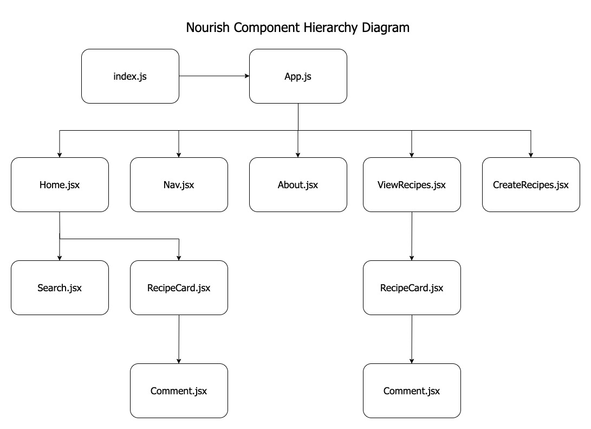
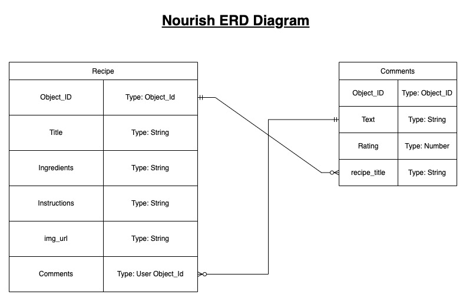

# Nourish - A Personal Cookbook

## Date: 2/8/2023

### By: Joshua Jumelet

[LinkedIn](www.linkedin.com/in/joshua-jumelet-155a13251) |
[GitHub](https://github.com/joshjumelet) |
[Trello](https://trello.com/b/2NeK496Q/nourish-a-personal-cookbook-project-board)

---

### _Nourish A Personal Cookbook is an application designed to allow users to input there very own personal recipes and keep a detailed log of ingredients and instructions to preparing their favorite meals. Not only can users input new recipes at any time they can also comment and rate their own as well as others recipes that are added. Users can submit useful tips or manipulations they've made to recipes and recommend them to other users. Nourish is the place to go for all your home dining needs!_

---

### _Technologies Used_

- M.E.R.N (Mongoose | Express | React | Node.js)
- JavaScript | HTML | CSS

---

### _Getting Started_

### Users interact with the webpage via navigational options displayed in the upper right of the screen. Each link brings a user to a new page. Those selections are a Home, About, Recipes, and Create Recipes. Nourish is designed to allow a user to input their very own recipe and even add their own image of the final product. A user has a field to input the name, ingredients list and instructions for their specific recipe. Once added the user can review, update and even delete any recipe within their library. Users are able to then interact with existing recipes by adding a comment detailing their own experience creating the recipe and any useful information they'd like to see added!

---

### _Screenshots_

##### Component Hierarchy Diagram

##### ERD Diagram

---

### _Future Updates_

- [ ] Recipe Details Page that user opens to display a specific recipe.
- [ ] Search function to allow user to navigate and find a specific recipe.
- [ ] Integrate a hide function that users interact with to update or comment on a recipe when selected.
- [ ] Integrate a 3rd party API

---

### Credits

##### GitHub: [GitHub](https://github.com/joshjumelet)

##### MongoDB Cloud: [Atlas](https://cloud.mongodb.com)

##### React: [React Docs](https://beta.reactjs.org/)

##### Images: [DuckDuckGo Search](https://duckduckgo.com/?t=hc&va=b)

##### CSS: [CSSreference.io](https://cssreference.io)
