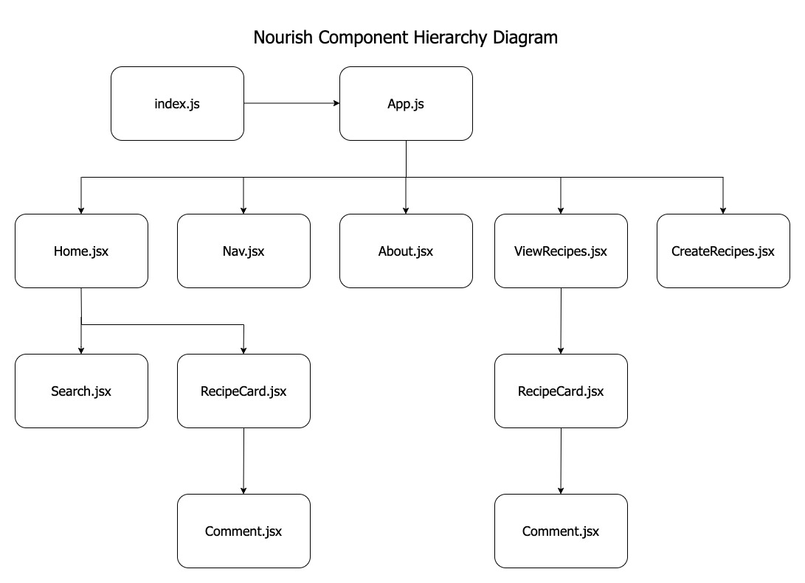
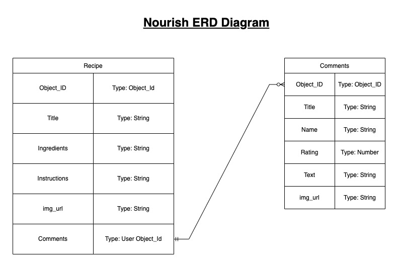

# Nourish - A Personal Cookbook

## Date: 2/8/2023

### By: Joshua Jumelet

[LinkedIn](www.linkedin.com/in/joshua-jumelet-155a13251) |
[GitHub](https://github.com/joshjumelet) |
[Trello](https://trello.com/b/2NeK496Q/nourish-a-personal-cookbook-project-board) |
[Heroku](https://www.heroku.com/)

---

### _Nourish A Personal Cookbook is an application designed to allow users to input there very own personal recipes and keep a detailed log of ingredients and instructions to preparing their favorite meals. Not only can users input new recipes at any time they can also comment and rate their own as well as others recipes that are added. Users can submit useful tips or manipulations they've made to recipes and recommend them to other users. Nourish is the place to go for all your home dining needs!_

---

### _Technologies Used_

- Mongoose
- Express
- React
- Node

---

### _Getting Started_

### Your task is to build a full-stack (Mongoose/Express/React/Node), professional-looking application with a functioning backend and frontend. Your website should allow users to interact with its pages, make requests (buttons, HTML forms, dropdowns, searchbars, etc.) to your backend, and display the data (text, images, etc.) in a meaningful way. Try to think about building an application that will create an engaging user experience.

---

### _Screenshots_

##### Component Hierarchy Diagram

##### ERD Diagram

---

### _Future Updates_

- [ ] Hidden routes using conditional rendering to mimic the functionality of user authentication
- [ ] Associate 2 or more of your models
- [ ] Integrate unit testing
- [ ] Integrate a 3rd party API

---

### Credits

##### Images: [DuckDuckGo Search](https://duckduckgo.com/?t=hc&va=b)

##### Markdown Cheatsheet: [GitHub](https://github.com/joshjumelet/u1_hw_markdown)
